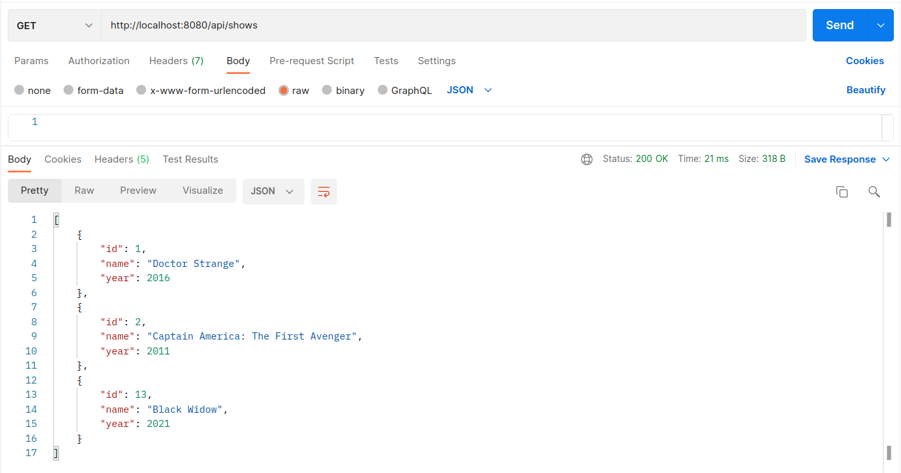
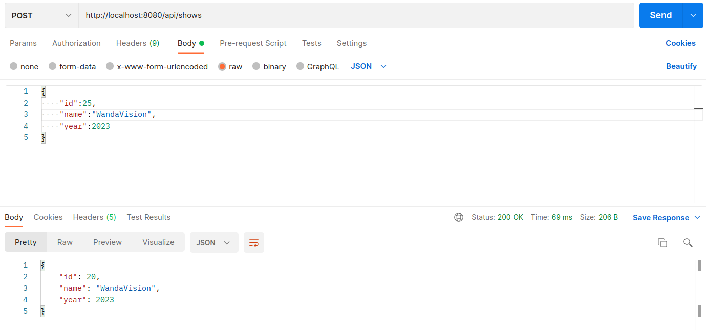

**Guião para o Lab2**

**Nome:** Pedro Miguel Afonso de Pina Monteiro <br>
**Nmec:** 97484 <br>
**email:** pmapm@ua.pt

**Exercício 3.3**<br>
**Wrapping-up and integrating concepts**<br>

Para a realização deste exercício foi usado como base o projeto Maven do exercício 4 do guião anterior.<br>
De forma semelhante ao exercício anterior foi também usado docker, um ficheiro docker-compose.yml, sendo assim possível instanciar o MySQL server e o phpMyAdmin. Contrariamente ao docker anterior neste foram criados volumes para armazenar os dados que são inseridos, ou seja, os dados não são guardados em memória e por isso não são perdidos.
```
volumes:
    - ./db:/var/lib/mysql
```

Foram criados alguns ficheiros distribuidos pelas pastas seguintes:
- entities:
    - Movie.java
    - Quote.java
- controllers:
    - MovieController.java
- forms:
    - PostData.java
- repositories
    - MovieRepository.java
    - QuoteRepository.java
- services
    - MovieService.java
    - QuoteService.java

Foi modelado o código de maneira a criar uma relação ***Many To One*** entre **Movie** e **Quotes**
- Quote.java
```java
    @Entity
    @Table(name = "quote")
    public class Quote {
    @Id
    @GeneratedValue(strategy = GenerationType.AUTO)
    private int quoteId;
    private String quote;

    @ManyToOne(optional = false)
    @JoinColumn(name = "movie_id", nullable = false)
```

- Movie.java
```java
@Entity
    @Table(name = "movies")
    public class Movie {
    @Id
    @GeneratedValue(strategy = GenerationType.AUTO)
    private int id;
    private String name;
    private int year;
```
Note-se que a tabela tem um atributo que é uma chave estrangeira, **movie_id**, pois um Movie pode ter 1 ou mais Quotes.
```java
@JoinColumn(name = "movie_id", nullable = false)
```

Notas acerca das anotações para base de dados:
- @Table(name = "..."): associa uma entidade a uma tabela
- @Column(name = "...", nullable = [true | false]): associa um campo ou uma função a um campo da base de dados
- @ManyToOne(...): indica uma relação de 1 para muitos

De maneira a separar o *controller* do *repository* foi adicionado um componente ***@Service***. <br>
É o *controller* que permite a ligação HTTP, mas é o *Service* que responde a todos os pedidos. O *Service* contém toda a lógica e interage com o *Repository*.<br>
**NOTA: o *RestController* não deve ter nenhuma referência para o *Repository*!**

É possível fazer pedidos GET e POST, ou seja, é possível ver e inserir dados e para isso foi usado o ***Postman***<br>

Exemplo pedido GET


Exemplo pedido POST


## **Review Questions**
A) <br>
As componentes *Controller* retornam uma string que indica qual é o template a ser renderizado, enquanto que as componentes *RestController* retornam objetos que vão ser posteriormente serializados e enviados como resposta, em formato JSON

B) <br>
- Entity:
    - Define a estrutura de dados, os campos necessários e os tipos de dados
- Repository:
    - cria uma interface CRUD sob uma entidade, estando disponíveis métodos para consultar, remover, criar e dar update (CRUD: Create Read Update Delete)
- Service:
    - Adiciona uma nova camada que contém toda a lógica, responde a pedidos HTTP e interage com o repository, isto é serve de intermediário entre o controller e o repository
- RestController:   
    - cria a associação entre os URL's e os métodos do Service

C) <br>
- @Table
    - cria a associação entre a entidade e a respetiva base de dados
- @Column
    - cria a associação entre os atributos de uma classe e os campos na base de dados
- @Id
    - define o atributo que é a chave primária na tabela

D) <br>